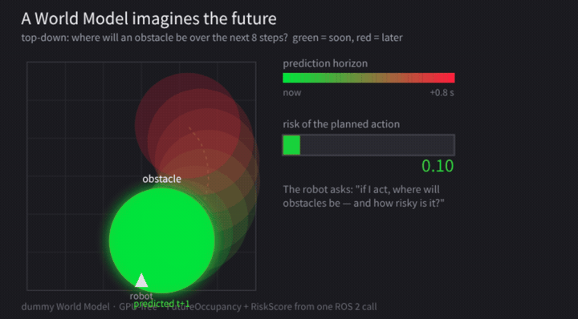
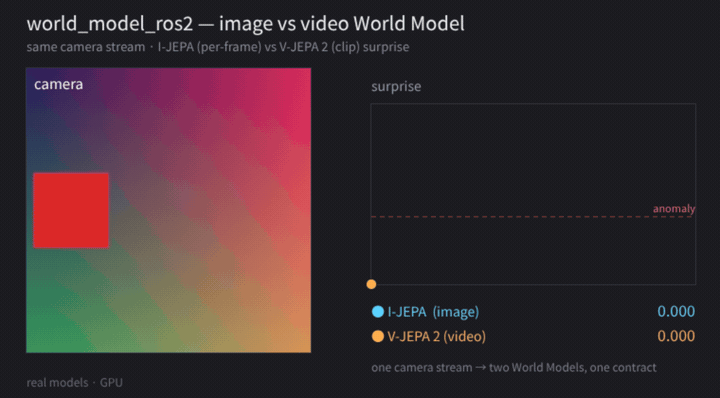
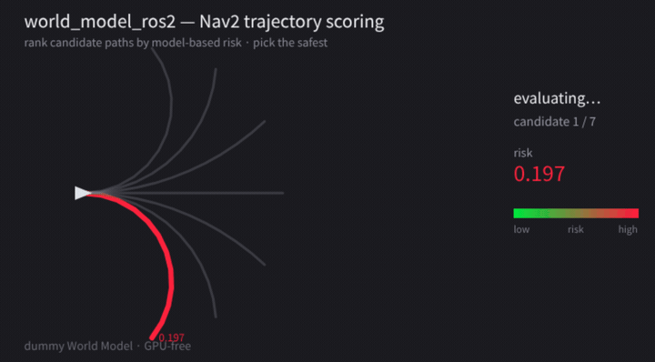

# world_model_ros2

[](https://github.com/rsasaki0109/worldmodels_ros2/actions/workflows/ci.yml)
[](LICENSE)
[](https://docs.ros.org/en/jazzy/)
[](https://rsasaki0109.github.io/worldmodels_ros2/)

**A ROS 2-native runtime, adapter hub, benchmark and visualization layer for
using *existing* World Models in robotics and autonomous driving.**

> Run V-JEPA2 / Cosmos / dummy world models from ROS 2. Predict future states,
> score trajectories, visualize imagination in RViz, and export rosbag2 data to
> robot-learning datasets.



<sub>Imagined `FutureOccupancy` (green = near, red = far) and action-conditioned
`RiskScore` from one ROS 2 call — here the GPU-free `dummy` adapter.</sub>

## Highlights

- **Two real model backends, one contract** — I-JEPA (image) and V-JEPA 2
  (video), both GPU-verified, swap by name (`load_model("vjepa2")`).
- **Local ⟷ remote split** — run heavy models (Cosmos/DreamZero) on a GPU box
  over a shared JSON wire; ROS 2 clients are unchanged.
- **Compiled Nav2 costmap layer** — predicted occupancy flows straight into the
  Nav2 costmap (real `nav2_costmap_2d::Layer`, not a mock).
- **rosbag2 → LeRobot** dataset export, **GPU-free**.
- **RViz + Foxglove** imagination viewer (a playable MCAP clip is bundled).
- **Live benchmark dashboard**, republished on every push →
  <https://rsasaki0109.github.io/worldmodels_ros2/>.
- **GPU-free CI** — adapters are pure numpy, tested with no ROS and no GPU.

`world_model_ros2` is **not** another foundation model. It is the
[Nav2](https://github.com/ros-navigation/navigation2)/`transformers`-style
**boundary** that lets a ROS 2 developer call a World Model the same way every
time — locally for light models, remotely for heavy ones — and get back typed
futures, occupancy, latents and risk.

```
ROS 2 observation  (camera / lidar / map / ego_state / instruction / action)
        │
        ▼
world_model_ros2 runtime
   local adapter:  dummy, V-JEPA2, small predictor
   remote adapter: Cosmos, DreamZero, custom server
        │
        ▼
outputs:  future frames · future occupancy · latent state
          action-conditioned rollout · risk / surprise score
        │
        ▼
consumers: RViz/Foxglove · Nav2 plugin · Autoware evaluator · VLA Zoo · Walking Zoo
```

## What this is / isn't

**It is:**
- Run local **and** remote World Model adapters from ROS 2
- Predict future states from sensor streams and candidate actions
- Score trajectories and commands with model-based risk
- Visualize imagined futures in RViz/Foxglove
- Benchmark latency, VRAM and temporal consistency
- Convert rosbag2 data into robot-learning / world-model datasets

**It is not:** a foundation model · a Dreamer reimplementation · a simulator
replacement · a safety-certified controller · a replacement for Nav2 or Autoware.

## Try it in 5 minutes — no robot, no dataset, no training

The `dummy` adapter is deterministic and **GPU-free**, so the whole pipeline
runs anywhere.

### 1. Standalone CLI (no ROS needed)

```bash
cd world_model_py
python -m world_model_py.cli list
python -m world_model_py.cli bench --adapter dummy --out report.html
# -> report.html with latency p50/p95, throughput, VRAM

python -m world_model_py.cli bench-compare --adapters dummy,remote --out compare.html
# -> one dashboard comparing adapters; spins a local server to measure the
#    remote adapter's HTTP overhead (e.g. dummy ~0.6ms vs remote ~11ms p50)
```

A live version of this dashboard is published to GitHub Pages on every push:
**<https://rsasaki0109.github.io/worldmodels_ros2/>**.

### 2. ROS 2 runtime

```bash
# build
colcon build
source install/setup.bash

# launch the runtime + a synthetic observation publisher (dummy adapter)
ros2 launch world_model_bringup dummy_runtime.launch.py

# in another terminal
ros2 topic echo /world_model_runtime/future_state
ros2 topic echo /world_model_runtime/risk_score
```

### 3. See the imagination (RViz)

One command brings up the dummy runtime, synthetic observations, the
imagination viewer and RViz. The predicted occupancy is stacked along +z
(higher = further into the future) and coloured green→red (near→far), with a
risk readout on top — all from the GPU-free dummy model.

```bash
ros2 launch world_model_viz imagination_demo.launch.py     # rviz:=false on headless
```

The viewer republishes `MarkerArray` on `/world_model_viz/imagination`.

### 4. See the imagination (Foxglove)

No ROS needed to *look*: a recorded clip ships in the repo. Open
[Foxglove](https://foxglove.dev/) → "Open local file" →
[`world_model_viz/demo/imagination.mcap`](world_model_viz/demo/imagination.mcap),
then import the layout
[`world_model_viz/foxglove/imagination.json`](world_model_viz/foxglove/imagination.json)
(menu → Layouts → Import). You get the 3D imagined-occupancy view plus a live
risk plot. To capture your own, record any run:

```bash
ros2 bag record -s mcap -o my_run \
    /world_model_viz/imagination /world_model_runtime/risk_score
```

(If the layout doesn't import cleanly on your Foxglove version, just add a **3D**
panel and enable the `/world_model_viz/imagination` topic — markers carry their
own colors.)

## Packages

| package | type | what |
|---|---|---|
| `world_model_msgs` | ament_cmake | the message/action **contract**: `Observation`, `ActionCondition`, `FutureState`, `FutureOccupancy`, `LatentState`, `RiskScore`, `Rollout`, `PredictFuture.action` |
| `world_model_py` | ament_python | adapter SDK (`load_model`), `dummy` / `ijepa` / `remote` adapters, lifecycle runtime node, reference `world-model-server`, benchmark, `world-model` CLI |
| `world_model_viz` | ament_python | imagination viewer: imagined `FutureOccupancy` + `RiskScore` → RViz `MarkerArray` |
| `world_model_datasets` | ament_python | `export_lerobot`: rosbag2 → LeRobot-compatible dataset (parquet + mp4 + meta), GPU-free |
| `world_model_nav2` | ament_python | score Nav2 candidate trajectories by model-based risk (`ScoreTrajectories` service + risk-coloured path markers) |
| `world_model_costmap` | ament_cmake (C++) | **compiled** `nav2_costmap_2d::Layer` that stamps predicted `FutureOccupancy` into the costmap |
| `world_model_bringup` | ament_cmake | launch files + demo config |

## Architecture

```
 INPUTS  (your robot · rosbag2 · Gazebo)
   camera · lidar · map · ego_state · instruction · action_history
        │
        │  world_model_msgs/Observation         ◀── the typed contract
        ▼
 ┌────────────────────────────────────────────────────────────────────┐
 │ world_model_py — runtime + adapter SDK                              │
 │   load_model(name) → WorldModelAdapter   (numpy in · numpy out)     │
 │                                                                     │
 │   local  ── dummy   (deterministic, GPU-free)                       │
 │          └─ ijepa   (I-JEPA: image → latent → surprise)             │
 │                                                                     │
 │   remote ── RemoteAdapter ══ HTTP/JSON (wire.py) ══▶ world-model-   │
 │                                                      server         │
 │                                          swap dummy → Cosmos /      │
 │                                          DreamZero on a GPU box     │
 │                                                                     │
 │   lifecycle runtime_node  ·  world-model CLI  ·  bench (HTML)       │
 └────────────────────────────────────────────────────────────────────┘
        │
        │  FutureState · FutureOccupancy · RiskScore · LatentState · Rollout
        ▼
 OUTPUTS ─┬────────────────┬───────────────────┬───────────────────────┐
          ▼                ▼                   ▼                       ▼
  world_model_viz    world_model_nav2    world_model_datasets    your consumers
  RViz imagination   ScoreTrajectories   rosbag2 → LeRobot       VLA Zoo ·
  MarkerArray        → safest path       parquet + mp4 + meta    Walking Zoo ·
  (green→red)        (risk-coloured)     (GPU-free)              Autoware eval
```

Two rules hold the design together: **adapters are pure numpy/dataclasses** (no
ROS, no GPU to test), and the **wire format is shared** by the remote adapter and
the server (they cannot drift). Everything light runs with no GPU; only the
`ijepa` adapter and a remote Cosmos/DreamZero host need one.

### Interfaces

| kind | name | type |
|---|---|---|
| topic (sub) | `/world_model_runtime/observation` | `world_model_msgs/Observation` |
| topic (pub) | `/world_model_runtime/future_state` | `world_model_msgs/FutureState` |
| topic (pub) | `/world_model_runtime/future_occupancy` | `world_model_msgs/FutureOccupancy` |
| topic (pub) | `/world_model_runtime/risk_score` | `world_model_msgs/RiskScore` |
| topic (pub) | `/world_model_viz/imagination` | `visualization_msgs/MarkerArray` |
| service | `/world_model_trajectory_scorer/score_trajectories` | `world_model_msgs/srv/ScoreTrajectories` |
| topic (pub) | `/world_model_trajectory_scorer/scored_paths` | `visualization_msgs/MarkerArray` |
| HTTP | `POST /predict_future`, `GET /health` | `world-model-server` (JSON) |
| CLI | `world-model list\|info\|bench`, `export_lerobot` | — |

## Adapter SDK

Adapters operate on plain numpy/dataclasses — **no ROS, no GPU required to
test** — so backends are unit-testable and benchmarkable in isolation. The ROS
layer is the only place that touches `world_model_msgs`.

```python
from world_model_py import load_model
from world_model_py.adapters import Observation, ActionCondition
import numpy as np

wm = load_model("dummy")                       # or "remote", url=...
obs = Observation(ego_state=np.zeros(4, np.float32))
future = wm.predict_future(obs, horizon=8)     # -> FuturePrediction
risk = wm.score_trajectory(obs, ActionCondition(action=np.zeros((8, 2), np.float32)))
```

Adding a backend = subclass `WorldModelAdapter`, implement `predict_future`,
and `register("mymodel", MyAdapter)`.

### Real model: JEPA latent server (`ijepa`)



<sub>Same camera stream, two real World Models on a GPU, one contract: I-JEPA
(per-frame image) and V-JEPA 2 (rolling video clip). Surprise stays low under
smooth motion and spikes on scene changes — actual model output, not a mock.</sub>

The first real backend turns a camera stream into latents and a **surprise**
score (cosine distance between successive latents — a model-based novelty /
anomaly signal). Two JEPA encoders ship:

- **`ijepa`** — I-JEPA image encoder via `transformers` (per-frame latent).
- **`vjepa2`** — **V-JEPA 2** video encoder via `torch.hub`
  (`facebookresearch/vjepa2`): buffers a rolling clip of frames and encodes the
  clip, so surprise reflects *temporal* novelty. Verified on a 16 GB GPU
  (ViT-L, fp16, clip_len 16): surprise spikes on scene cuts.

```python
load_model("ijepa",  model_id="facebook/ijepa_vith14_1k", device="cuda")
load_model("vjepa2", entry="vjepa2_vit_large", device="cuda")  # downloads weights
```

```bash
# optional extras, not required for dummy/remote or CI:
pip install "torch" "transformers>=4.40"

ros2 launch world_model_bringup dummy_runtime.launch.py \
    adapter:=ijepa model_id:=facebook/ijepa_vith14_1k
ros2 topic echo /world_model_runtime/risk_score    # surprise per frame
```

Verified on a 16 GB GPU (GPU): I-JEPA ViT-H/14, fp16, 1280-d
latents — identical frames ≈ 0 surprise, a changed frame ≈ 0.65. torch and
transformers are **optional**: imported lazily, so `dummy`/`remote` and CI need
neither.

## rosbag2 → robot-learning dataset

Turn a recording into a LeRobot-compatible dataset — **no GPU**. The image
topic is the master clock; state/action are nearest-neighbour joined to each
frame (header stamp when present) and matches outside `--tol-ms` are dropped.

```bash
ros2 run world_model_datasets export_lerobot \
    --bag ./my_bag \
    --image-topic /camera/image_raw \
    --state-topic /odom \
    --action-topic /cmd_vel \
    --fps 10 --task "drive forward" --out ./hf_dataset
```

Output (v2.1 layout): `meta/{info,episodes,tasks,stats}.json[l]`,
`data/chunk-000/episode_*.parquet`, `videos/chunk-000/<key>/episode_*.mp4`.
Supported state/action types: `nav_msgs/Odometry`, `sensor_msgs/JointState`,
`geometry_msgs/Twist[Stamped]`, `std_msgs/Float{32,64}MultiArray`.

> Honesty: validated structurally (parquet round-trips, mp4 is ffprobe-readable,
> counts consistent), **not** against the `lerobot` loader (not a dependency
> here). Verify against your `lerobot` version before training.

## Remote adapters (Cosmos / DreamZero)

Heavy World Foundation Models don't fit on a 16 GB GPU, so they run on another
machine behind a JSON/HTTP boundary. The `remote` adapter is the local stub;
`world-model-server` is a reference host. Both share one wire format
(`world_model_py.wire`) so they can't drift. On a GPU box you swap the server's
backing adapter from `dummy` to a heavy one — ROS 2 clients are unchanged.

```bash
# host (GPU box in production; dummy here -> no GPU needed)
world-model-server --adapter dummy --port 8080

# ROS 2 client talks to it
ros2 launch world_model_bringup remote_runtime.launch.py
# or directly:
ros2 run world_model_py runtime_node --ros-args \
    -p adapter:=remote -p remote_url:=http://HOST:8080/predict_future
```

Endpoints: `POST /predict_future` (FuturePrediction JSON), `GET /health`. The
local↔remote round-trip is tested over real HTTP with stdlib only — the
`remote` adapter reproduces the host's output exactly.

## Nav2 trajectory scoring (mock)



Rank candidate paths by model-based risk before the robot commits to one — a
mock of a Nav2 controller critic (a service today, a compiled `nav2_core`
plugin later). Each path becomes a body-frame action sequence and is scored by
the World Model; the safest wins.

```bash
ros2 launch world_model_nav2 scorer_demo.launch.py
# straight  risk=0.129
# fast      risk=0.213
# swerve    risk=0.165
# -> safest: straight
```

Service `~/score_trajectories` (`world_model_msgs/srv/ScoreTrajectories`) takes
`nav_msgs/Path[]` and returns a risk per path plus the safest index; scored
paths are published as risk-coloured (green→red) markers for RViz.

For the **production path**, `world_model_costmap` is a *compiled*
`nav2_costmap_2d::Layer` that stamps the model's predicted `FutureOccupancy`
straight into the Nav2 costmap — so any planner/controller avoids predicted
obstacles. See [world_model_costmap/README.md](world_model_costmap/README.md).

## Roadmap (90-day MVP)

- **0–30d (this scaffold):** msgs, adapter SDK, dummy + remote adapters,
  lifecycle node, CLI, HTML smoke/bench report — **all GPU-free**. ✅
- **31–60d:** JEPA latent adapter (image→latent→surprise) ✅, RViz imagination
  markers ✅, rosbag2 replay demo (next).
- **61–90d:** rosbag2 → LeRobotDataset converter ✅, Nav2 trajectory-scoring
  mock ✅, compiled Nav2 costmap layer ✅, remote adapter + reference server
  (Cosmos/DreamZero-ready) ✅, benchmark dashboard, VLA Zoo / Walking Zoo examples.

## Contributing

Contributions are welcome — especially new **adapters** (model backends) and
**consumers** (Nav2 / Autoware / VLA / viz). See [CONTRIBUTING.md](CONTRIBUTING.md)
for the build/test flow and the design rules that keep adapters ROS-free and
GPU-optional.

## License

Apache-2.0. See [LICENSE](LICENSE).
